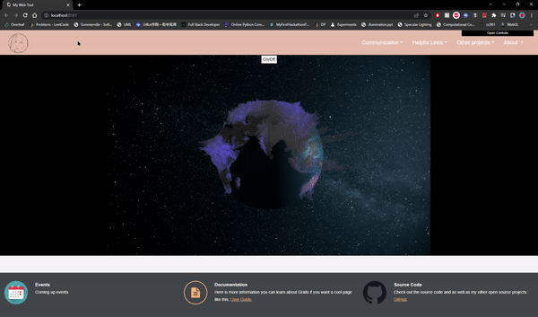
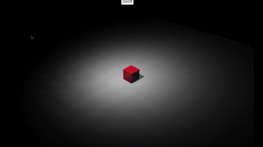
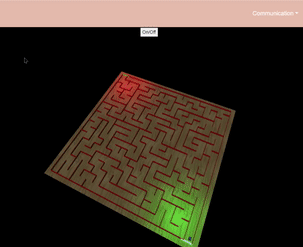
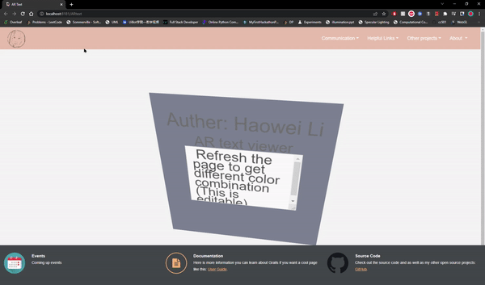

<h1>My Web Tool</h1>
This web tool is for personal use but feel free to use my template

<h1>Demos</h1>
It contains some Three.js demos that I've worked on. More will be in the future.

       <h2>Earth</h2>
              
              

              This scene has directional light from right and ambiant light, and star background. 
              The earth object uses Phong shading, texture mapping, specular mapping, and normal mapping for realistic looking. 
              Moreover, I deployed functions that can virtualize and 3D the saved data. In this case, I use population according to geographical location  
              and dynamically creating rectangular pillars which map onto the sphere object.
              

       <h2>Controllable Cube</h2>
              
              

              This is a controllable cube, controlled through keyboard: up, down, left, right.
              

       <h2>Maze</h2>
              
              

              Utilizing controllable cube, I was able to create a maze game. The maze spawned randomly which means many possibilities. 
              The challenging is to implement collision detection such that every time cube hit a wall it will go back to start.
              

       <h2>AR Text</h2>
              
              

              This is an attempt to create realistic AR view on webpage, and the result is in the gif.
              

